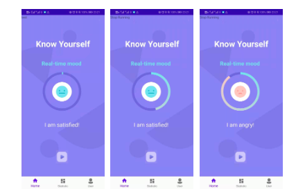
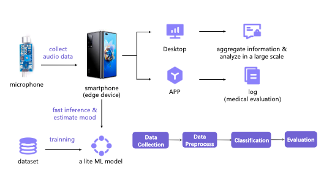

# Emovo: A Lite Voice-Based Anger Detection App on Smartphones

## Introduction

Emotion recognition has received significant interests thanks to the rapid development of machine learning. Currently, most emotion recognition tasks use large-scale neural network with multimodal input for higher accuracy. However, these multimodal methods are difficult to deploy on smart mobile devices. We propose Emovo, a portable real-time emotion recognition system. Built for Android platform, Emovo records the user’s speech, extracts features and performs classification based on a specially trained lite CNN model. Emovo can finish recognition in real time, log the history and provide medical advice on user’s mental health. We evaluate our system on two public datasets and one real world dataset. The results show that, Emovo can detect anger from audio pieces with low latency, and can be easily deployed on smartphones. Moreover, we statistically prove that content and language effects the system performance.

## System Overview

We first train the model offline. To be specific, we train the CNN model on two public datasets using PyTorch before deploying the model on smart phone. Then we export the model and load it on the phone. After recognizing the emotion, Emovo warns the users in real time if certain problems are detected. Moreover, Emovo records the users’ emotion locally and constructs database for further analysis. Users can review the history and evaluate their psychological states according to the long-term statistical analysis.

## Machine Learning Model

Firstly, we collect both Chinese and English audio datasets with labeled emotions. Secondly, we extract hidden features from those audio pieces. Finally, we used a lite 1-D Convolution-Neural-Network (CNN) to classify these features into different emotions. For simplicity, we only care about whether the audio piece belongs to anger or non-anger, so it turns out into a 2-class classification task.

#### Dataset
- IEMOCAP. IEMOCAP(The Interactive Emotional Dyadic Motion Capture (IEMOCAP) Database) is a multimodal
dataset consisting of 151 videos of recorded dialogues performed by two speakers. Each session contains 302 videos, which are annotated for the presence of 9 emotion (angry, excited, fear, sad, surprised, frustrated, happy, disappointed and neutral). This dataset is recorded across 5 sessions with different pairs of speakers. All the dialogues are in English.

- CH-SIMS. The CH-SIMS dataset is a novel Chinese multimodal sentiment analysis dataset with more fine-grained annotations of modality. It contains in total 2281 video clips from 60 different videos. The average length of segments is 3.67 s and the average word count per segments are 15. All the video clips are in Chinese.
We integrate these two datasets, extracting all the audio data and the emotion labels for training and testing

#### Model

Emotion recognition tasks usually have multimodal input, including video, image, audio and so on. Each modal may have its own encoder. For Audio, the most common encoder are linear layers or 1-D Convolutional layers. In many sound-based machine learning models, the 1-D convolutional layers are applied since it has been proven that can extract the hidden features in sound waves. 

Here, we empirically choose 1-D CNN as the baseline model. It contains 7 convolutional layers, after these layers, a linear layer is applied for output the prediction. The Model's structure is shown in fig \ref{Fig:Model}. This model have 460578 parameters, we generate a lite model for mobile phone of size 3M, which is suitable for a lite app.

## How to use

Please feel free to contact me at yuangtong1999@gmail.com for details.

## Credits

Thanks to @YueSun and @Wanying Mo for their contribution to this project.
